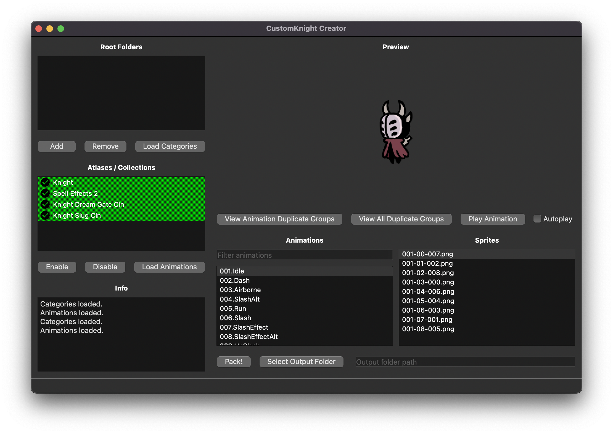

# CustomKnight Creator



A program to track, deduplicate, and pack sprites for use with [CustomKnight](https://github.com/PrashantMohta/HollowKnight.CustomKnight) (a Hollow Knight skin customization mod)

Inspired by [SpritePacker](https://github.com/magegihk/HollowKnight.SpritePacker) by MageGi

## Installing

* Go to the [releases](https://github.com/cmot17/CustomKnight-Creator/releases) to find the latest version.

## Usage

There is an excellent tutorial video from Maverick#2345:

(EMBED VIDEO)

Visit the [wiki](https://github.com/cmot17/CustomKnight-Creator/wiki) for a written tutorial.


## Running from source

* This project is built using Python 3.10.
* To run the project, just download the source code, install the dependencies (preferably in a [virtual environment](https://docs.python.org/3/tutorial/venv.html)) and run main.py.
    * PyQt6: `python -m pip install PyQt6`
    * Pillow: `pythom -m pip install Pillow`

## Packaging

To package the project, use the following [PyInstaller](https://github.com/pyinstaller/pyinstaller) commands: (they are platform specific)

### MacOS:
```
pyinstaller main.py -w -n "CustomKnight Creator" -i resources/SheoIcon.icns --add-data resources:resources
```
### Windows:
```
(idk i need to test)
```
### Linux:
```
(idk i need to test)
```

## Help

If you have any problems, feel free to open an issue on this GitHub.

## Authors
cmot17

## Version History

* 1.0
    * Initial Release

## License

This project is licensed under the GNU GPLv3 License - see the LICENSE.md file for details

## Acknowledgments

* Huge thanks to Maverick#2345 from the Hollow Knight community for being incredibly helpful throughout the developement, providing lots of useful testing, and making an awesome tutorial video.
* anjaperryyeet#9759 for feedback on the UI
* MageGi for [SpritePacker](https://github.com/magegihk/HollowKnight.SpritePacker), the inspiration for this program